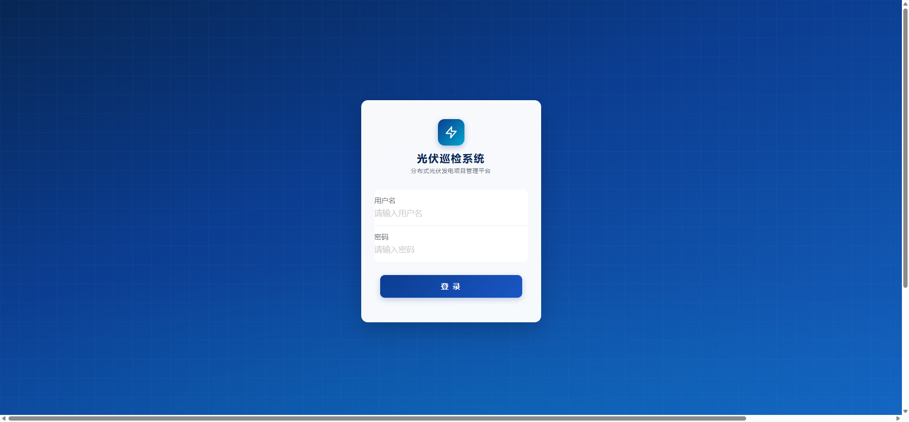
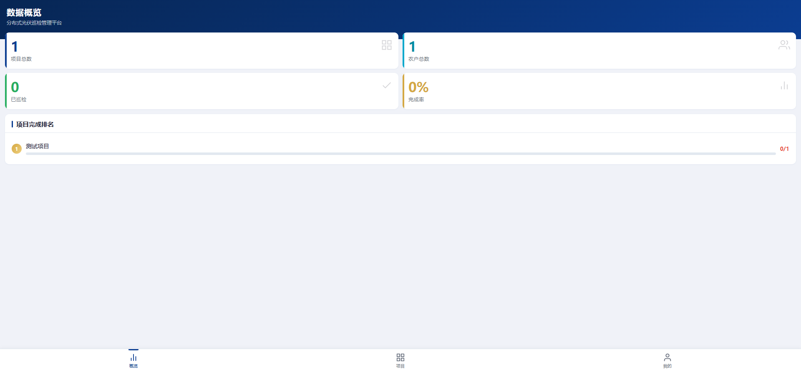

# Farmer PV Inspection System

<p align="center">
  <strong>光伏巡检系统</strong> — 分布式光伏项目巡检管理平台
</p>

---

## Introduction

Farmer PV Inspection System 是一套面向分布式光伏发电项目的巡检管理平台，为现场巡检员和管理员提供从项目管理、农户信息维护、结构化巡检到报告导出的完整工作流。

**核心功能：**

- **项目管理** — 管理分布式光伏项目及其关联农户信息，支持 Excel 批量导入
- **结构化巡检** — 6 大类 64 项标准化巡检清单，结果以 JSON 存储，支持拍照取证
- **巡检计划** — 创建和分配巡检计划，跟踪计划执行进度
- **报告导出** — 巡检报告 PDF 生成，支持批量 ZIP 导出（异步任务）
- **角色权限** — 管理员（Admin）和巡检员（Inspector）两种角色，不同操作界面
- **移动优先** — 响应式设计，巡检员可在手机端完成全部操作

## Screenshots

<table>
  <tr>
    <td></td>
    <td></td>
  </tr>
  <tr>
    <td align="center">登录页</td>
    <td align="center">管理看板</td>
  </tr>
</table>

## Tech Stack

| Layer | Technology |
|-------|-----------|
| **Backend** | Java 17, Spring Boot 2.7.x, MyBatis-Plus, Spring Security (JWT) |
| **Frontend** | React 18, TypeScript, Tailwind CSS v4, Zustand, Vite 5 |
| **Database** | MySQL 8.0 (Flyway migrations) |
| **Storage** | MinIO (dev) / 阿里云 OSS (prod) |
| **PDF** | iText 7 |
| **Icons** | Lucide React |

## Prerequisites

- **Java 17+** (JDK)
- **Node.js 18+** & npm
- **MySQL 8.0+**
- **MinIO** (用于文件存储，开发环境)
- **Maven 3.8+**

## Getting Started

### 1. Clone the Repository

```bash
git clone https://github.com/your-username/farmer-pv-inspection.git
cd farmer-pv-inspection
```

### 2. Database Setup

创建 MySQL 数据库：

```sql
CREATE DATABASE pv_inspection DEFAULT CHARACTER SET utf8mb4 COLLATE utf8mb4_general_ci;
```

Flyway 会在应用启动时自动执行数据库迁移（`backend/src/main/resources/db/migration/`）。

### 3. Backend

```bash
cd backend

# 修改数据库连接信息（如需要）
# 编辑 src/main/resources/application-dev.yml
# 默认: localhost:3306/pv_inspection, root/root

# 构建并启动
mvn clean install
mvn spring-boot:run -Dspring-boot.run.profiles=dev
```

后端默认运行在 **http://localhost:8080**

首次启动会自动：
- 执行 Flyway 迁移，创建所有表
- 插入默认管理员账号（见 `V8__seed_default_admin.sql`）

### 4. Frontend

```bash
cd frontend

# 安装依赖
npm install

# 启动开发服务器
npm run dev
```

前端默认运行在 **http://localhost:3000**，`/api` 请求自动代理到后端 8080 端口。

### 5. MinIO (可选)

开发环境需要启动 MinIO 服务：

```bash
# Docker 方式
docker run -p 9000:9000 -p 9001:9001 \
  -e MINIO_ROOT_USER=minioadmin \
  -e MINIO_ROOT_PASSWORD=minioadmin \
  minio/minio server /data --console-address ":9001"
```

默认配置：
- Endpoint: `http://localhost:9000`
- Access Key / Secret Key: `minioadmin` / `minioadmin`
- Bucket: `pv-inspection`

## Project Structure

```
farmer-pv-inspection/
├── backend/                          # Spring Boot 后端
│   └── src/main/
│       ├── java/com/pv/inspection/
│       │   ├── config/               # Security, CORS, MinIO, Flyway 配置
│       │   ├── common/               # 统一响应封装、异常处理、常量
│       │   ├── auth/                 # 登录认证、JWT
│       │   ├── user/                 # 用户管理
│       │   ├── project/              # 项目管理
│       │   ├── farmer/               # 农户管理、Excel 批量导入
│       │   ├── plan/                 # 巡检计划
│       │   ├── inspection/           # 巡检记录、清单模板
│       │   ├── stats/                # 统计聚合
│       │   ├── export/               # PDF 导出、ZIP 打包、异步任务
│       │   └── storage/              # MinIO/OSS、水印、压缩
│       └── resources/
│           ├── application.yml       # 主配置
│           ├── application-dev.yml   # 开发环境
│           ├── application-prod.yml  # 生产环境
│           └── db/migration/         # Flyway 迁移脚本 (V1-V11)
│
├── frontend/                         # React 前端
│   └── src/
│       ├── api/                      # Axios 客户端、接口定义
│       ├── components/               # 通用组件 (Layout, UI)
│       ├── pages/
│       │   ├── admin/                # 管理员页面 (看板、项目、农户、计划、用户)
│       │   ├── inspector/            # 巡检员页面 (项目、农户、巡检表单)
│       │   ├── records/              # 巡检记录列表与详情
│       │   ├── profile/              # 个人中心
│       │   └── login/                # 登录页
│       ├── hooks/                    # 自定义 Hooks
│       ├── utils/                    # 工具函数 (照片压缩、GPS、认证)
│       └── router/                   # 路由配置 (角色守卫)
│
├── specs/                            # Spec-Kit 功能规格文档
├── CLAUDE.md                         # AI 开发指引
└── prd.md                            # 产品需求文档
```

## Available Scripts

### Backend

```bash
cd backend
mvn clean install                     # 构建
mvn spring-boot:run                   # 启动 (默认 dev profile)
mvn spring-boot:run -Dspring-boot.run.profiles=prod  # 生产模式
mvn test                              # 运行全部测试
mvn test -Dtest=ClassName             # 运行单个测试类
```

### Frontend

```bash
cd frontend
npm install                           # 安装依赖
npm run dev                           # 开发服务器 (localhost:3000)
npm run build                         # 生产构建
npm run preview                       # 预览生产构建
npm test                              # 运行测试 (Vitest)
npm run lint                          # ESLint 检查
```

## Configuration

### Environment Variables

| Variable | Description | Default |
|----------|-------------|---------|
| `DB_USERNAME` | MySQL 用户名 | `root` |
| `DB_PASSWORD` | MySQL 密码 | `root` |
| `JWT_SECRET` | JWT 签名密钥 | (内置默认值) |
| `MINIO_ENDPOINT` | MinIO/OSS 地址 | `http://localhost:9000` |
| `MINIO_ACCESS_KEY` | MinIO Access Key | `minioadmin` |
| `MINIO_SECRET_KEY` | MinIO Secret Key | `minioadmin` |
| `DATABASE_URL` | 生产环境数据库 URL | (同开发环境) |

## API Convention

所有接口统一返回格式：

```json
{
  "code": 200,
  "message": "success",
  "data": {}
}
```

认证方式：`Authorization: Bearer <JWT_TOKEN>`，Token 有效期 2 小时。

## License

This project is licensed under the MIT License — see the [LICENSE](LICENSE) file for details.
